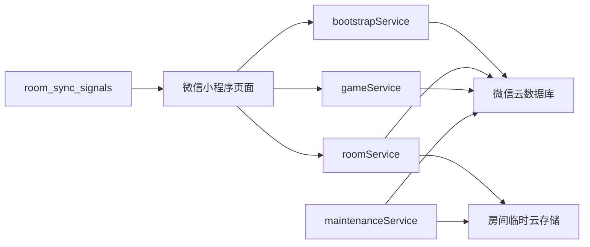

# 《secret dictator》当前架构

## 架构目标

当前架构优先保证规则正确、隐藏信息隔离、并发一致和断线恢复。在此前提下，通过同步信号、快照缓存、按需心跳和有限并发清理控制微信云开发资源消耗。

本文只描述仓库中已经存在的实现，不预留尚未实现的目录、技术栈或接口。产品行为见 [`product.md`](product.md)，线上协议见 [`api.md`](api.md)，游戏判定见 [`game_rules.md`](game_rules.md)。

## 运行时与代码布局

- 客户端：原生微信小程序，JavaScript、WXML、WXSS。
- 服务端：微信云开发 JavaScript 云函数，依赖 `wx-server-sdk ~2.4.0`。
- 数据：微信云数据库和房间临时云存储资源。
- 前端入口位于 `frontend/`；普通页面、房间分包和结果分包由 `frontend/app.json` 注册。
- 云函数位于 `cloudfunctions/bootstrapService`、`roomService`、`gameService` 和 `maintenanceService`。
- 自动化测试位于 `tests/backend` 和 `tests/frontend`。

前端页面不直接写业务集合。除不含业务内容的同步信号外，页面也不直接读取数据库文档；业务读取和写入统一经过云函数。

## 系统边界



- `bootstrapService` 只负责会话初始化、活跃房间恢复和清除恢复锚点。
- `roomService` 负责大厅生命周期、席位、准备、房间设置和单人模式虚拟席位。
- `gameService` 负责开局、游戏命令、快照读取、胜负和结果。
- `maintenanceService` 负责集合初始化、过期房间清理、临时资源清理和幂等记录清理，不对客户端开放。

## 数据模型

| 集合 | 作用 | 可见性 |
| --- | --- | --- |
| `rooms` | 房间生命周期、模式、房主、人数、版本和过期时间 | 服务端 |
| `room_members` | 房间成员、席位、准备态、在线态和虚拟席位归属 | 服务端 |
| `user_profiles` | 以 openid 为主键的轻量会话恢复锚点 | 服务端 |
| `game_core` | 完整游戏真相和状态机唯一可信源 | 仅服务端 |
| `room_public_snapshots` | 对局或结果阶段的公共投影 | 经云函数读取 |
| `player_private_snapshots` | 单个席位的私密投影和待办 | 经鉴权云函数读取 |
| `room_sync_signals` | `roomId`、房间状态和版本等无敏感通知 | 当前房间成员只读监听 |
| `game_events` | 公开事件及内部排障所需事件数据 | 服务端 |
| `command_records` | 写操作幂等记录，短期保留 | 服务端 |
| `maintenance_state` | 维护初始化节流状态 | 服务端 |

大厅没有公共或私密快照文档；`getLobbySnapshot` 从 `rooms + room_members` 即时构建视图。开局后，`game_core` 是真相源，每次成功状态迁移同步更新核心状态、公共投影、受影响的私密投影、事件和同步信号。

## 状态与命令处理

房间状态为 `lobby → in_game → ended`，过期后进入 `expired` 并由维护链路清理。

游戏交互阶段包括：

```text
nomination
  → voting
  → legislative_president
  → legislative_chancellor
  → veto_response（按需）
  → executive_action（按需）
  → 下一轮 nomination 或 game_ended
```

`hitler_check` 和 `round_result` 是自动推进的内部阶段。命令处理会继续推进到下一个需要玩家输入的阶段或终局。

房间和游戏业务命令遵循同一边界：

1. 从微信云函数上下文取得 openid。
2. 校验房间、成员、模式、阶段和操作者。
3. 通过 `commandId` 做幂等校验；会话恢复和在线状态刷新不属于业务命令。
4. 游戏命令通过 `expectedVersion` 做乐观并发控制。
5. 在事务中修改真相并生成事件与投影。
6. 返回接受结果，前端再读取新快照。

前端不能根据按钮点击结果推演下一状态；视图始终以最新服务端快照为准。

## 公开、私密与真相隔离

- `game_core` 包含身份映射、牌堆、手牌和未公开投票等完整真相，永不下发。
- 公共快照只含所有玩家都能看到的信息，包括座位、政府、政策轨、公开票型和公共历史。
- 私密快照按席位生成，只含该席位可见的身份、手牌、个人投票、调查结果、政策预览和待办。
- 结果阶段才能公开全部身份和终局复盘。
- 房号、客户端传入的 `memberId` 或 `controlledMemberId` 都不是权限凭证。

普通多人房间只能按 openid 解析真实成员。单人模式允许真实房主通过 `controlledMemberId` 操控归属于自己的虚拟席位，但后端仍须校验 `room.mode === "solo"`、虚拟成员归属和当前行动权。

## 同步与恢复

正常同步路径：

1. 页面读取一次大厅或游戏快照。
2. 页面监听当前房间的 `room_sync_signals`。
3. 信号版本增加后，经对应云函数拉取新快照。
4. 命令成功、应用回到前台或页面恢复时主动补拉。
5. 监听建立失败或运行中断开时，退避重试监听并启用轮询兜底。

客户端只消费版本不小于本地版本的快照。页面隐藏或卸载时关闭监听和轮询，避免后台空耗。快照缓存用于页面间快速呈现，但缓存不能替代服务端刷新和权限校验。

活跃房间恢复优先使用 `user_profiles` 中的锚点；有效的大厅、对局和结果锚点分别恢复到对应页面。资料存在但锚点缺失或失效时，服务端只从真实玩家仍为 `active`、房间未过期且状态为 `lobby` 或 `in_game` 的成员记录中自愈，并且只有恰好一个合法候选才在事务重检后写回。`offline`、虚拟成员、结束或过期房间以及多候选均不自愈，防止撤销主动退出或错误选择历史房间。

显式清除锚点会把内部 `activeRoomStatus` 标记为 `recovery_suppressed`，在新房间写入有效锚点前禁止成员扫描撤销此次清除；因锚点损坏触发的内部清理不写该标记，仍可受限自愈。客户端清除时携带当前 `roomId`，服务端仅条件清除匹配房间，避免旧页面的延迟请求覆盖新锚点。既有锚点的在线刷新和缺锚自愈都在最终写入事务中重读资料、房间和成员；锚点已变化或已被抑制时不写回，并向当前恢复请求返回空房间。事务执行异常不转换为空恢复，而是沿统一协议返回可重试的 `INTERNAL_ERROR`。零候选是正常状态，不产生日志；只记录多候选和事务重检失败等异常分支。

`room_sync_signals` 不得包含玩家资料、角色、手牌、任务、牌堆或结果细节。它的云数据库安全规则必须限制为当前活跃房间成员只读，客户端禁止写入。

## 生命周期与资源控制

- 大厅创建后固定过期时间为 30 分钟。
- 开局后固定过期时间为 3 小时。
- 游戏结束后结果保留 30 分钟。
- 普通游戏操作不延长上述阶段过期时间。
- 房间头像是临时资源，随房间清理。
- `command_records` 按过期时间批量清理。
- 维护任务使用有限并发，避免一次清理产生无界请求。

集合初始化只允许出现在维护和发布初始化链路。`ensureCollectionsDaily()` 将“集合已存在”视为成功；业务 action 不得检查缺集合后创建并重试。新增集合时必须更新维护清单、部署并触发初始化。

资源优化的优先顺序是减少无变化快照读取、避免把心跳绑定到每次读取、控制维护底噪，再考虑差异化私密投影。任何优化都不能放宽鉴权、泄露真相或绕过状态机。

## 错误、日志与测试

- 云函数对外返回统一成功/失败 envelope；未预期异常对用户收敛为可重试的 `INTERNAL_ERROR`。
- 排障时沿前端调用、云函数 action、业务校验、事务写入和日志追踪根因，不用重试或吞异常掩盖故障。
- 自动化测试覆盖规则场景、开局、结果快照、房间隔离与并发、席位争抢、恢复、维护并发、幂等记录、同步降级、缓存和前端映射。
- 需要真实云环境、数据库安全规则或微信页面交互的行为仍应在微信开发者工具与目标云环境验证。

## 架构变更规则

- 新集合、状态、不变量或安全边界必须同步修改本文和测试。
- 新 action、DTO、枚举或错误码必须同步修改 [`api.md`](api.md)。
- 改变产品可见行为必须同步修改 [`product.md`](product.md)。
- 跨模块或高风险变更先写 RFC；长期且难以逆转的技术取舍再写 ADR。
- 旧 MVP 文档位于 `archive/mvp`，只能用于追溯，不能作为实现依据。
