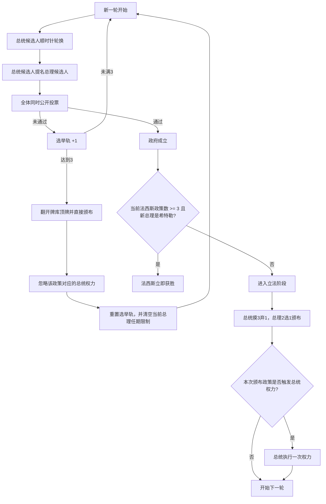

# 《揭秘希特勒 / Secret Hitler》游戏规则与流程说明

## 文档目的

本文档基于官方规则整理，目标不是做玩家向的简短介绍，而是沉淀一份适合后续产品设计、交互设计和程序实现的规则说明。  
文档会尽量把：

- 胜负条件
- 人数配置
- 回合流程
- 特殊权力
- 边界条件
- 适合程序建模的关键状态

说明清楚，便于后续开发微信小程序时直接参考。

## 1. 核心概念

### 1.1 阵营与身份

游戏支持 `5-10` 人。

所有玩家会被秘密分配到以下三类身份之一：

- `自由派（Liberal）`
- `法西斯（Fascist）`
- `希特勒（Hitler）`

其中：

- 自由派属于自由派阵营。
- 普通法西斯和希特勒都属于法西斯阵营。
- 希特勒是法西斯阵营中的特殊身份。

### 1.2 胜利条件

自由派满足任一条件即获胜：

- 颁布 `5` 张自由派政策。
- 处决到希特勒。

法西斯满足任一条件即获胜：

- 颁布 `6` 张法西斯政策。
- 在已经颁布 `3` 张或以上法西斯政策后，希特勒被当选为总理。

### 1.3 公开信息与隐藏信息

公开信息包括：

- 所有玩家座位顺序
- 当前总统候选人 / 总理候选人 / 当选政府
- 每轮公开投票结果
- 已颁布的政策数量与类型
- 选举轨进度
- 已被处决的玩家
- 游戏是否结束，以及胜利阵营

隐藏信息包括：

- 玩家真实身份（自由派 / 法西斯 / 希特勒）
- 玩家党派归属卡内容
- 总统在立法阶段摸到的 3 张政策牌
- 总理在立法阶段收到的 2 张政策牌
- 调查忠诚时看到的结果
- 牌库顶端内容

### 1.4 说谎规则

本游戏允许玩家对“隐藏信息”说谎。

例如：

- 总统和总理可以谎报自己拿到过什么政策牌。
- 总统可以谎报调查忠诚的结果。
- 玩家可以伪装自己是自由派。

只有两类“终局相关的希特勒信息”必须说真话：

- 玩家被处决时，如果他是希特勒，必须如实确认。
- 当已颁布至少 3 张法西斯政策后，如果新当选总理是希特勒，必须如实确认。

## 2. 人数配置

### 2.1 身份分配表

| 玩家数 | 自由派 | 普通法西斯 | 希特勒 | 希特勒是否知道普通法西斯 |
| --- | --- | --- | --- | --- |
| 5 | 3 | 1 | 1 | 是 |
| 6 | 4 | 1 | 1 | 是 |
| 7 | 4 | 2 | 1 | 否 |
| 8 | 5 | 2 | 1 | 否 |
| 9 | 5 | 3 | 1 | 否 |
| 10 | 6 | 3 | 1 | 否 |

补充说明：

- 普通法西斯始终知道彼此是谁，也知道谁是希特勒。
- 只有在 `5-6` 人局时，希特勒会知道普通法西斯是谁。
- 在 `7-10` 人局时，希特勒不知道普通法西斯是谁。

### 2.2 政策牌构成

政策牌一共 `17` 张：

- `6` 张自由派政策
- `11` 张法西斯政策

它们混洗后形成同一个政策牌库。

## 3. 开局准备

### 3.1 桌面与牌堆准备

1. 根据玩家人数选择对应的法西斯政策轨。
2. 放置一条固定的自由派政策轨。
3. 将 `11` 张法西斯政策牌与 `6` 张自由派政策牌混洗为一个牌库。
4. 准备弃牌堆。
5. 将选举轨标记放在起始位置。

### 3.2 每位玩家拿到的内容

每位玩家应拿到：

- 1 张秘密身份卡
- 1 张党派归属卡
- 1 张 `Ja!` 赞成票
- 1 张 `Nein` 反对票

这里必须注意“秘密身份卡”和“党派归属卡”是两个概念：

- 希特勒的秘密身份是 `Hitler`
- 但希特勒的党派归属卡显示为 `Fascist`

这样设计是为了保证“调查忠诚”只会看到阵营，不会直接暴露某人是不是希特勒。

### 3.3 初始信息揭示

所有人秘密查看自己的身份后，进行一次开局夜晚信息揭示。

`5-6` 人局：

- 普通法西斯和希特勒互相确认身份。

`7-10` 人局：

- 所有普通法西斯互相确认身份。
- 普通法西斯同时确认谁是希特勒。
- 希特勒本人不知道普通法西斯是谁。

### 3.4 首位总统候选人

随机选择一名玩家作为第一轮总统候选人。

## 4. 回合总览

每一轮固定由以下阶段组成：

1. `选举阶段（Election）`
2. `立法阶段（Legislative Session）`
3. `执行阶段（Executive Action，可选）`

其中：

- 不是每轮都会有执行阶段。
- 只有当本轮颁布的是“带总统权力的法西斯政策”时，才会进入执行阶段。

## 5. 选举阶段

### 5.1 总统候选人轮换

每轮开始时，总统候选人标记顺时针传给下一位玩家。

例外：

- 如果上一轮触发了“特别选举”，则下一轮并不是从刚刚那位特别当选总统的左手边继续，而是回到“发动特别选举的总统”的左手边继续。

### 5.2 提名总理候选人

当前总统候选人从“符合资格的其他玩家”中提名 1 人作为总理候选人。

总理提名资格规则如下：

- 总统不能提名自己。
- 上一届“当选政府”的总统，通常不能在下一轮被提名为总理。
- 上一届“当选政府”的总理，不能在下一轮被提名为总理。
- 任期限制只影响“总理提名”，不影响总统轮换。
- 被提名资格是看“上一届成功当选的政府”，不是看“上一轮被提名但没过票的组合”。

`只剩 5 名存活玩家` 时有特殊规则：

- 只有上一届总理不能再次被提名为总理。
- 上一届总统此时可以被提名为总理。

### 5.3 全体公开投票

所有存活玩家同时打出 `Ja!` 或 `Nein`。

规则要点：

- 候选总统和候选总理也要投票。
- 投票结果是公开的，不是秘密投票。
- 平票按未通过处理。
- 只有“赞成票严格超过半数”才算政府通过。

### 5.4 投票失败

如果投票失败：

- 本轮政府未成立。
- 总统候选人失去本轮机会。
- 选举轨 `+1`。
- 总统候选人标记顺时针传给下一位玩家，进入下一轮提名。

### 5.5 三连败与混乱政策

如果连续 `3` 次政府提名都没有成功通过：

1. 立即翻开牌库顶的 1 张政策牌并直接颁布。
2. 如果这张牌本来会赋予总统权力，该权力被忽略，不执行。
3. 选举轨重置。
4. 现有的总理任期限制全部清空。
5. 下一轮开始时，所有存活玩家都重新获得总理被提名资格。

补充说明：

- 这张因混乱而直接颁布的政策，仍然算“正式颁布”，会推进对应政策轨，也会触发胜负判定。
- 但它不会触发总统权力，因为这次不是由一个成功当选的政府颁布的。

### 5.6 投票通过后的即时判定

如果投票通过：

- 当前总统候选人成为正式总统。
- 当前总理候选人成为正式总理。

若此时场上已经颁布了至少 `3` 张法西斯政策，则需要立刻检查：

- 如果新当选总理是希特勒，法西斯立即获胜，游戏结束。
- 如果新当选总理不是希特勒，则游戏继续进入立法阶段。

这个规则意味着：

- 当一名玩家在 `3+` 法西斯政策后成功当选总理且游戏没有结束时，全场都能确定他“不是希特勒”。

## 6. 立法阶段

立法阶段只在政府成功当选后发生。

### 6.1 标准流程

1. 总统从牌库顶摸 `3` 张政策牌。
2. 总统秘密查看后，弃掉其中 `1` 张到弃牌堆。
3. 总统把剩余 `2` 张政策牌一起交给总理。
4. 总理秘密查看后，弃掉其中 `1` 张到弃牌堆。
5. 总理把剩余 `1` 张作为本轮颁布政策，正面放到对应政策轨上。

### 6.2 立法阶段的限制

以下行为都不允许：

- 总统与总理在选牌过程中进行语言或非语言沟通。
- 故意用随机方式选牌，假装“自己没有决定权”。
- 总统一张一张传牌，借此观察总理反应。
- 向全场展示被弃掉的政策牌。

核心原则是：

- 总统和总理必须真实做出秘密选择。
- 但他们事后可以公开撒谎。

### 6.3 牌库不足时的处理

如果在需要继续使用政策牌时牌库数量不足：

- 将牌库剩余牌与弃牌堆一起洗混，组成新的牌库。

官方规则里最常见的两个触发时点是：

- 立法阶段结束后，若牌库剩余不足 `3` 张，则立即重洗，供后续回合使用。
- 因三连败需要翻开牌库顶牌时，若牌库不足，也应先按规则重洗后再执行。

### 6.4 立法阶段后的去向

本轮颁布完政策后，进入以下情况之一：

- 若自由派政策累计达到 `5`，自由派立即获胜。
- 若法西斯政策累计达到 `6`，法西斯立即获胜。
- 若本次颁布的是带总统权力的法西斯政策，则进入执行阶段。
- 其他情况直接进入下一轮选举阶段。

## 7. 执行阶段与总统权力

只有当本轮颁布的法西斯政策格子上带有总统权力时，当前总统才必须执行一次权力。  
该权力必须在下一轮开始前完成。

### 7.1 不同人数下的法西斯政策轨权力表

| 已颁布法西斯政策数 | 5-6 人局 | 7-8 人局 | 9-10 人局 |
| --- | --- | --- | --- |
| 1 | 无 | 无 | 调查忠诚 |
| 2 | 无 | 调查忠诚 | 调查忠诚 |
| 3 | 政策预览 | 特别选举 | 特别选举 |
| 4 | 处决 | 处决 | 处决 |
| 5 | 处决 | 处决 | 处决 |

补充说明：

- 第 `5` 张法西斯政策颁布后，从之后的立法阶段开始，会额外永久解锁“否决权”。
- 第 `6` 张法西斯政策不是权力格，而是法西斯直接胜利。

### 7.2 调查忠诚（Investigate Loyalty）

执行方式：

- 总统选择 1 名玩家进行调查。
- 被调查者交出自己的“党派归属卡”，不是秘密身份卡。
- 总统秘密查看后将卡还回去。

规则要点：

- 总统看到的只有阵营归属，自由派看到的是 `Liberal`，法西斯与希特勒看到的都是 `Fascist`。
- 总统可以公开说明结果，也可以撒谎。
- 同一名玩家整局游戏不能被重复调查两次。

### 7.3 特别选举（Call Special Election）

执行方式：

- 总统指定任意另一名玩家，直接成为下一轮总统候选人。

规则要点：

- 被指定的人即使本来有任期限制，也仍然可以成为这次特别选举的总统候选人。
- 该玩家随后按正常规则提名总理、组织投票、进入立法阶段。
- 特别选举不会永久改变顺时针总统轮换顺序。
- 特别选举结束后，总统轮换会回到“发动特别选举的总统”的左手边继续。
- 如果总统把特别选举权交给了自己左手边的玩家，那么该玩家可能连续两轮都成为总统候选人：一次是特别选举，一次是正常轮换。

### 7.4 政策预览（Policy Peek）

执行方式：

- 总统秘密查看牌库顶 `3` 张政策牌。
- 查看后按原顺序放回牌库顶。

规则要点：

- 总统不能改变顺序。
- 总统之后可以如实公开信息，也可以撒谎。

### 7.5 处决（Execution）

执行方式：

- 总统指定并处决 1 名玩家。

规则要点：

- 如果被处决者是希特勒，自由派立即获胜。
- 如果被处决者不是希特勒，场上不公开他的真实身份或阵营。
- 被处决玩家立即出局，且之后不能：
  - 发言
  - 投票
  - 被提名
  - 成为总统候选人

## 8. 否决权（Veto Power）

否决权不是一次性的总统权力，而是一个在后期永久开启的新规则。

### 8.1 何时开启

当第 `5` 张法西斯政策已经被颁布后，从之后每一次立法阶段开始，否决权都可用。

注意：

- 第 `5` 张法西斯政策本身照常先触发该格对应的“处决”。
- 否决权是从“后续立法阶段”开始生效，不是在同一个立法阶段内生效。

### 8.2 使用流程

在正常立法流程中：

1. 总统仍然先摸 `3` 张并弃掉 `1` 张。
2. 总理拿到剩余 `2` 张后，可以提出“否决本届议程”。
3. 总统可以同意，也可以拒绝。

如果总统同意否决：

- 当前总理手中的 `2` 张政策牌全部弃掉。
- 本轮不颁布任何政策。
- 总统标记按正常顺时针传给下一位玩家。
- 这次否决视为一次“无效政府”，选举轨 `+1`。

如果总统拒绝否决：

- 总理必须从手里的 `2` 张政策牌中选择 `1` 张颁布。

### 8.3 否决权与选举轨

每一次成功否决都会让选举轨前进 `1` 格。

因此：

- 否决可能导致选举轨到达 `3`。
- 如果因此达到 `3`，则按“三连败与混乱政策”的规则处理：翻开牌库顶牌直接颁布，忽略权力，重置选举轨。

## 9. 关键边界规则

这一节专门列出实现时最容易弄错的点。

### 9.1 任期限制只看“上一届当选政府”

不要把“上一轮提名失败的组合”错误地记成任期限制对象。  
只有真正投票通过并当选的那一对总统 / 总理，才会在下一轮影响总理提名资格。

### 9.2 任期限制只限制“总理提名”，不限制总统轮换

任何存活玩家都可能在正常轮换中成为总统候选人，哪怕他上一轮刚当过总理。

### 9.3 只剩 5 名存活玩家时，限制会变宽

当场上存活玩家数变成 `5` 时：

- 上一届总理仍然不能再被提名为总理。
- 上一届总统可以被提名为总理。

这个规则对“开局就是 5 人局”和“多人局中途有人被处决后只剩 5 人”都适用。

### 9.4 三连败直接翻牌会清空总理提名限制

一旦因三连败触发混乱政策：

- 选举轨重置。
- 之前记录的总统 / 总理任期限制也一起清空。
- 下一轮开始时所有存活玩家都可被提名为总理。

### 9.5 任意正面颁布的政策都会重置选举轨

只要有政策被正面放上政策轨，不论来源是：

- 正常当选政府的立法结果
- 三连败后的牌库顶牌

都会立刻把选举轨重置。

### 9.6 调查忠诚看的是阵营，不是角色

调查忠诚不会直接分辨“普通法西斯”和“希特勒”。  
两者在党派归属卡上都显示为 `Fascist`。

### 9.7 非希特勒在 3 张法西斯政策后成功当选总理，会得到公开确认

如果游戏没有因为“希特勒当选总理”而结束，那么所有人都能推出：

- 这位新总理一定不是希特勒。

### 9.8 处决普通玩家不会公开阵营

处决只在“击中希特勒”时公开真实结果。  
如果被处决者不是希特勒，其阵营依旧是隐藏信息。

### 9.9 特别选举不会改变长期轮换顺序

特别选举只是临时插入一次总统候选人，不会把轮换顺序永久改写。

### 9.10 第 5 张法西斯政策既会处决，也会为后续回合解锁否决权

不要把这两个效果混成同一个动作：

- 当下立刻执行的是“处决”
- 之后长期生效的是“否决权已解锁”

### 9.11 否决不会清空任期限制

否决发生在“政府已经成功当选之后”的立法阶段。  
因此如果本轮是总统与总理协商后成功否决：

- 下一轮的总理提名限制，仍然以上一届已当选的总统 / 总理为准。
- 否决只会让选举轨 `+1`，不会像三连败翻牌那样清空任期限制。

## 10. 面向开发的规则抽象

这一节不是官方术语，而是为了后续实现更稳定。

### 10.1 推荐维护的核心状态

建议后端或核心状态机至少维护以下字段：

- `gameStatus`：`setup / election / legislative_president / legislative_chancellor / executive / ended`
- `players`
- `alivePlayerIds`
- `playerRoleMap`
- `playerPartyMap`
- `presidentCandidateId`
- `chancellorCandidateId`
- `currentPresidentId`
- `currentChancellorId`
- `previousElectedPresidentId`
- `previousElectedChancellorId`
- `specialElectionCallerId`
- `forcedNextPresidentId`
- `electionTracker`
- `liberalPolicyCount`
- `fascistPolicyCount`
- `policyDeck`
- `discardDeck`
- `investigatedPlayerIds`
- `vetoUnlocked`
- `winner`
- `winReason`

### 10.2 推荐的判定顺序

建议在程序中按下面的结算顺序做校验：

1. 提名时先判断总理候选人是否符合资格。
2. 投票结算后，若通过且当前法西斯政策数已达 `3+`，先检查总理是否是希特勒。
3. 若未结束，再进入立法阶段。
4. 政策颁布后，先检查是否达到 `5` 自由派或 `6` 法西斯政策的胜利条件。
5. 若未结束，再判断本次法西斯政策是否赋予总统权力。
6. 若赋予权力，则执行该权力后再进入下一轮。

### 10.3 推荐的服务端强校验点

以下规则建议由服务端或房主端强制校验，而不是只靠前端提示：

- 提名是否符合任期限制
- 候选人是否存活
- 投票是否来自全部存活玩家
- 投票是否同时揭示
- 立法阶段是否严格按“总统 3 选 2，总理 2 选 1”执行
- 调查对象是否已被调查过
- 特别选举目标是否为“另一名存活玩家”
- 处决目标是否存活
- 否决权是否已经解锁
- 游戏结束后是否阻止继续操作

### 10.4 推荐的前端展示要点

为了避免玩家误解，前端最好明确展示：

- 当前是第几轮、哪个阶段
- 谁是总统候选人 / 总理候选人 / 当选总统 / 当选总理
- 当前选举轨进度
- 当前自由派 / 法西斯政策数量
- 当前是否已经解锁否决权
- 当前有哪些人因为规则原因不能被提名为总理
- 当前是否因为 `3+` 法西斯政策而进入“希特勒当选即输”的危险阶段

## 11. 官方来源与开发提示

### 11.1 规则来源

本文档主要基于以下官方资料整理：

- 官方规则 PDF：<https://www.secrethitler.com/assets/Secret_Hitler_Rules.pdf>
- 官方 Print and Play PDF：<https://www.secrethitler.com/assets/Secret_Hitler_Print_and_Play.pdf>
